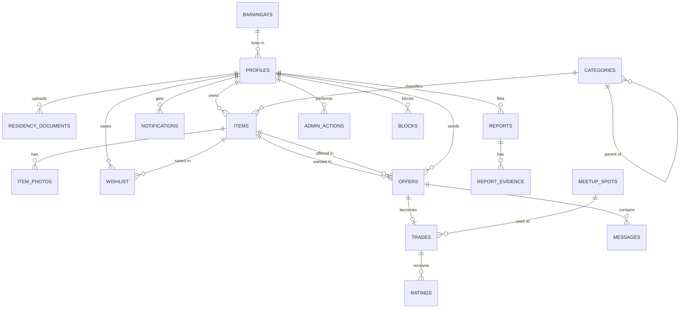

# 06 · Database Design (Supabase Postgres)

Conventions: `uuid` PKs (`gen_random_uuid()`) except `profiles.id` which is the **Clerk user id (text)**; `timestamptz`; Postgres enums (or text + check); `jsonb`; RLS enabled on every table. Identity (password, email verification, sessions, MFA) lives in Clerk, so there are no password/session/token tables.

## ERD

## Enums
`user_role` (resident, moderator, admin) · `account_status` (pending, verified, suspended, deleted) · `item_status` (draft, available, pending, exchanged, removed, expired, paused) · `item_condition` (like_new, good, fair, for_repair) · `trade_type` (item_for_item, multiple_smaller) · `offer_status` (pending, accepted, rejected, cancelled, completed, expired, countered) · `trade_status` (meetup_pending, meetup_set, both_confirmed, completed, cancelled, disputed) · `report_status` (open, assigned, upheld, dismissed) · `report_reason` (prohibited, asking_money, scam, not_as_described, duplicate, harassment, moved_outside, other)

## Tables

### barangays
`id`, `name` unique, `description`, `is_enabled`.

### profiles (one row per Clerk user)
| Column | Type | Notes |
|---|---|---|
| id | text PK | Clerk user id (`auth.jwt()->>'sub'`) |
| full_name | text | |
| email | text | copied from Clerk by webhook |
| mobile | text | +63 |
| barangay_id | uuid FK | |
| street_address | text | never exposed publicly |
| role | user_role | default resident |
| status | account_status | default pending |
| avatar_url | text | Clerk image or uploaded |
| bio | text | |
| show_mobile, allow_pre_offer_msg, show_trade_count, show_barangay, show_last_active, show_usual_meetup, hide_from_search | boolean | privacy toggles |
| last_active_at | timestamptz | |
| approved_at, approved_by | timestamptz, text | |
| suspended_until | timestamptz | |
| onboarded_at | timestamptz | set after onboarding form |
| deleted_at | timestamptz | |

### residency_documents
`id`, `user_id` FK, `storage_path` (private bucket), `proof_type`, `status` (submitted, needs_review, approved, rejected), `reviewed_by`, `reviewed_at`, `reject_reason`, `delete_after` (approved_at + 90 days), `deleted_at`.

### categories
`id`, `parent_id`, `name`, `icon`, `sort_order`, `is_enabled`.

### items
`id`, `code` (CT-118-xxxx), `owner_id` FK, `category_id`, `title` (≤80), `description`, `condition`, `looking_for`, `trade_type`, `barangay_id`, `meetup_spot_id`, `status`, `views_count`, `expires_at` (+30 d), `auto_renew`, `flagged`, `removed_reason`, `removed_by`, `search` (generated `tsvector` on title+description, GIN index).

### item_photos
`id`, `item_id`, `storage_path`, `sort_order`, `is_main`.

### wishlist
`user_id`, `item_id`, `saved_at`; PK(user_id,item_id). Limit enforced in a check function (pending 10, verified 20). Owners can never read rows for their own items except an aggregate count view.

### offers
`id`, `wanted_item_id`, `offered_item_id`, `from_user_id`, `to_user_id`, `message` (≤500), `proposed_spot_id`, `proposed_at`, `flexibility`, `status`, `parent_offer_id` (Tier 2), `expires_at` (+3 d), `responded_at`.
Partial unique index: one active (pending/accepted) offer per `wanted_item_id`.

### trades
`id`, `code` (TR-xxxx), `offer_id` unique, `meetup_spot_id`, `meetup_at`, `meetup_note`, `owner_confirmed_at`, `requester_confirmed_at`, `status`, `cancel_reason`, `cancelled_by`, `completed_at`.

### messages
`id`, `offer_id`, `sender_id`, `body`, `photo_path`, `read_at`, `created_at`. Added to the Realtime publication.

### ratings
`id`, `trade_id`, `rater_id`, `ratee_id`, `stars` (1-5), `tags` jsonb, `comment`, `described`, `communication`, `on_time`, `friendly`; unique(trade_id, rater_id).

### notifications
`id`, `user_id`, `type`, `title`, `body`, `link`, `read_at`, `created_at`. Added to the Realtime publication.
**notification_preferences:** `user_id`, `type`, `in_app`, `email`, `sms`.

### reports / report_evidence
reports: `id`, `reporter_id`, `is_anonymous`, `target_type`, `target_id`, `reason`, `details`, `attach_chat`, `status`, `is_urgent`, `assigned_to`, `decision`, `moderation_note`, `resolved_at`. report_evidence: `report_id`, `storage_path`.

### meetup_spots, announcements, legal_documents, prohibited_keywords, blocks
As in earlier design: spots (`name`, `barangay_id`, `flag`, `is_enabled`, `uses_count`), announcements, legal_documents (`type`, `version`, `effective_date`, `body`), prohibited_keywords (`word`, `action` hold/flag), blocks (`user_id`, `blocked_id`).

### admin_actions (append-only)
`id`, `admin_id` (null for system), `action`, `subject_type`, `subject_id`, `rule_ref`, `reason`, `created_at`. A trigger raises an exception on UPDATE/DELETE; purge job runs as service role through a controlled function.

### Tier 2: follows, saved_searches

## Storage buckets
| Bucket | Access | Notes |
|---|---|---|
| listing-photos | public read; insert only in own folder `{userId}/` | compress on client |
| residency-docs | **private**, no client policies | server uploads/reads with service role; signed URL 60 s; every read logged |
| chat-photos | private; read by offer parties | signed URLs |
| report-evidence | private; admins and reporter | |

## RLS summary
| Table | Policy idea |
|---|---|
| profiles | select public columns via a `public_profiles` view; owner can update own non-privileged fields; role/status changed only by server (service role) |
| items | anyone selects non-draft, non-removed; owner insert/update/delete own |
| wishlist | owner only |
| offers | select/insert/update only for from_user or to_user; status changes via RPC |
| trades | parties only; changes via RPC |
| messages | offer parties only (insert requires verified, not blocked) |
| notifications | owner only |
| reports | reporter can insert and read own; admins read all |
| admin_actions, residency_documents, prohibited_keywords | no client access (server only) |

Pattern (user-owned rows): `using ((select auth.jwt()->>'sub') = user_id)`.

## SQL functions (RPC, security definer, run atomically)
`create_offer`, `accept_offer` (item pending, create trade, reject other offers, notify), `reject_offer`, `cancel_offer`, `update_meetup`, `confirm_trade` (rejects before `meetup_at`; completes when both confirmed), `dispute_trade`, `renew_item`, `save_item` (limit check).

## Indexes
items(status, category_id, barangay_id, created_at), GIN items.search, offers(wanted_item_id, status), offers(to_user_id, status), messages(offer_id, created_at), notifications(user_id, read_at), reports(status, created_at).

## Scheduled jobs (Vercel Cron → `/api/cron/*`, secured with `CRON_SECRET`)
| Job | Schedule | Action |
|---|---|---|
| expire-listings | hourly | expire past `expires_at`; reminders at 12 and 3 days |
| expire-offers | hourly | pending past 3 days to expired |
| purge-residency | daily | delete storage file and row past `delete_after` |
| purge-old | monthly | messages/audit older than 24 months (document views 12) |
| meetup-reminders | daily | day-before email |
| overdue-approvals | hourly | flag pending profiles older than 24 h |
